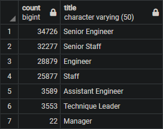

# Pewlett-Hackard-Analysis

## Overview
We are determining the number of retiring employees per title, and identifying employees who are eligible to participate in a mentorship program. This is to help the manager prepare for the “silver tsunami” as many current employees reach retirement age.

## Results

### Links
Table Links: [Count of Retiring Titles](Data/retiring_titles.csv) / [Mentorship Eligibility List](Data/mentorship_eligibility.csv)

### Details
We created a table of all the titles and the amount of people of retiring age with those titles, see the 'Retiring Titles' link above.
- the majority of the people retiring will be Senior Engineers and Senior Staff with a large amount of Engineers and Staff as well
- there is a smaller number of Technique Leaders and Assistant Engineers who will be retiring along with 2 Managers

We've also supplied a list of the current employees that are eligible for a Mentorship role which you can find in the 'Mentorship Eligibility' link above.
- This list shows the all the details of their current employment currently that list isn't very large compared to the amount of people retiring
- You can also filter this list for the titles you feel are required most for the Mentorship program

## Summary
There will be 90,398 people that will need to be replaced as the 'silver tsunami' group begins to retire. You currently only have 1,549 people who can be Mentors to your current employees so you may need to change your eligibility for Mentoring.

One solution may be to change the eligibility for the mentorship program. For some reason you need to be born in a specific year to be in this Mentorship program which seems a little limiting. Instead you could do something like everyone born on or before that year:

```
SELECT DISTINCT ON (e.emp_no) e.emp_no, e.first_name, e.last_name, e.birth_date, d.from_date, d.to_date, ti.title
FROM employees as e
INNER JOIN dept_emp as d
ON e.emp_no = d.emp_no
INNER JOIN titles as ti
ON e.emp_no = ti.emp_no
WHERE (e.birth_date < '1965-12-31')
AND (d.to_date = '9999-01-01')
ORDER BY emp_no;
```

Or you could even decide to change it from using their birthday to everyone who has been in their current position for a specific amount of time. In the code below I've used the  date '1990-01-01' to show anyone who's been at their current position since at least that date but you could change that to be whatever date you think would provide them with enough experience required to be a mentor:
```
SELECT DISTINCT ON (e.emp_no) e.emp_no, e.first_name, e.last_name, e.birth_date, d.from_date, d.to_date, ti.title
FROM employees as e
INNER JOIN dept_emp as d
ON e.emp_no = d.emp_no
INNER JOIN titles as ti
ON e.emp_no = ti.emp_no
WHERE (d.from_date < '1990-01-01')
AND (d.to_date = '9999-01-01')
ORDER BY emp_no;
```

To give an idea of how many people that is, you can use the below which will split the data to show how many people would be able to mentor if you used people who have been in their position since before 1990:
```
SELECT count(e.emp_no), ti.title
FROM employees as e
INNER JOIN dept_emp as d
ON e.emp_no = d.emp_no
INNER JOIN titles as ti
ON e.emp_no = ti.emp_no
WHERE (d.from_date < '1990-01-01')
AND (d.to_date = '9999-01-01')
GROUP BY ti.title
ORDER BY count DESC
```
This table shows the result of that code:


